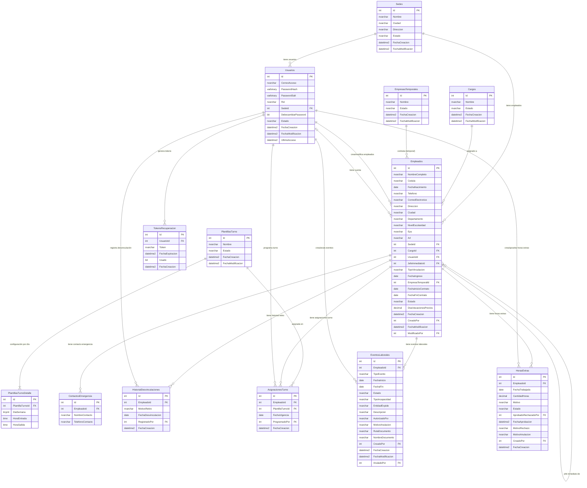

# Modelo Entidad-Relación — Sistema de Administración de Empleados

## Diagrama ER (Mermaid)

```mermaid
erDiagram

    Sedes {
        int Id PK
        nvarchar Nombre
        nvarchar Ciudad
        nvarchar Direccion
        nvarchar Estado
        datetime2 FechaCreacion
        datetime2 FechaModificacion
    }

    Cargos {
        int Id PK
        nvarchar Nombre
        nvarchar Estado
        datetime2 FechaCreacion
        datetime2 FechaModificacion
    }

    EmpresasTemporales {
        int Id PK
        nvarchar Nombre
        nvarchar Estado
        datetime2 FechaCreacion
        datetime2 FechaModificacion
    }

    PlantillasTurno {
        int Id PK
        nvarchar Nombre
        nvarchar Estado
        datetime2 FechaCreacion
        datetime2 FechaModificacion
    }

    PlantillasTurnoDetalle {
        int Id PK
        int PlantillaTurnoId FK
        tinyint DiaSemana
        time HoraEntrada
        time HoraSalida
    }

    Usuarios {
        int Id PK
        nvarchar CorreoAcceso
        varbinary PasswordHash
        varbinary PasswordSalt
        nvarchar Rol
        int SedeId FK
        bit DebecambiarPassword
        nvarchar Estado
        datetime2 FechaCreacion
        datetime2 FechaModificacion
        datetime2 UltimoAcceso
    }

    TokensRecuperacion {
        int Id PK
        int UsuarioId FK
        nvarchar Token
        datetime2 FechaExpiracion
        bit Usado
        datetime2 FechaCreacion
    }

    Empleados {
        int Id PK
        nvarchar NombreCompleto
        nvarchar Cedula
        date FechaNacimiento
        nvarchar Telefono
        nvarchar CorreoElectronico
        nvarchar Direccion
        nvarchar Ciudad
        nvarchar Departamento
        nvarchar NivelEscolaridad
        nvarchar Eps
        nvarchar Arl
        int SedeId FK
        int CargoId FK
        int UsuarioId FK
        int JefeInmediatoId FK
        nvarchar TipoVinculacion
        date FechaIngreso
        int EmpresaTemporalId FK
        date FechaInicioContrato
        date FechaFinContrato
        nvarchar Estado
        decimal DiasVacacionesPrevios
        datetime2 FechaCreacion
        int CreadoPor FK
        datetime2 FechaModificacion
        int ModificadoPor FK
    }

    ContactosEmergencia {
        int Id PK
        int EmpleadoId FK
        nvarchar NombreContacto
        nvarchar TelefonoContacto
    }

    HistorialDesvinculaciones {
        int Id PK
        int EmpleadoId FK
        nvarchar MotivoRetiro
        date FechaDesvinculacion
        int RegistradoPor FK
        datetime2 FechaCreacion
    }

    AsignacionesTurno {
        int Id PK
        int EmpleadoId FK
        int PlantillaTurnoId FK
        date FechaVigencia
        int ProgramadoPor FK
        datetime2 FechaCreacion
    }

    EventosLaborales {
        int Id PK
        int EmpleadoId FK
        nvarchar TipoEvento
        date FechaInicio
        date FechaFin
        nvarchar Estado
        nvarchar TipoIncapacidad
        nvarchar EntidadExpide
        nvarchar Descripcion
        nvarchar AutorizadoPor
        nvarchar MotivoAnulacion
        nvarchar RutaDocumento
        nvarchar NombreDocumento
        int CreadoPor FK
        datetime2 FechaCreacion
        datetime2 FechaModificacion
        int AnuladoPor FK
    }

    HorasExtras {
        int Id PK
        int EmpleadoId FK
        date FechaTrabajada
        decimal CantidadHoras
        nvarchar Motivo
        nvarchar Estado
        int AprobadoRechazadoPor FK
        datetime2 FechaAprobacion
        nvarchar MotivoRechazo
        nvarchar MotivoAnulacion
        int CreadoPor FK
        datetime2 FechaCreacion
    }

    %% ─── RELACIONES ──────────────────────────────────────────

    %% Datos maestros → independientes
    Sedes              ||--o{ Usuarios              : "tiene usuarios"
    Sedes              ||--o{ Empleados             : "tiene empleados"

    Cargos             ||--o{ Empleados             : "asignado a"

    EmpresasTemporales ||--o{ Empleados             : "contrata (temporal)"

    %% Plantillas de turno
    PlantillasTurno    ||--|{ PlantillasTurnoDetalle : "configuración por día"
    PlantillasTurno    ||--o{ AsignacionesTurno     : "asignada en"

    %% Autenticación
    Usuarios           ||--o{ TokensRecuperacion    : "genera tokens"

    %% Auto-relación: jefe inmediato
    Empleados          }o--o| Empleados             : "jefe inmediato de"

    %% Empleado ↔ Usuario (cuenta de acceso)
    Empleados          }o--o| Usuarios              : "tiene cuenta"

    %% Empleado ↔ subtablas
    Empleados          ||--o{ ContactosEmergencia   : "tiene contacto emergencia"
    Empleados          ||--o{ HistorialDesvinculaciones : "tiene historial retiro"
    Empleados          ||--o{ AsignacionesTurno     : "tiene asignaciones turno"
    Empleados          ||--o{ EventosLaborales      : "tiene eventos laborales"
    Empleados          ||--o{ HorasExtras           : "tiene horas extras"

    %% Auditoría: usuarios que crean/modifican
    Usuarios           ||--o{ Empleados             : "crea/modifica empleados"
    Usuarios           ||--o{ EventosLaborales      : "crea/anula eventos"
    Usuarios           ||--o{ HorasExtras           : "crea/aprueba horas extras"
    Usuarios           ||--o{ HistorialDesvinculaciones : "registra desvinculación"
    Usuarios           ||--o{ AsignacionesTurno     : "programa turno"
```
