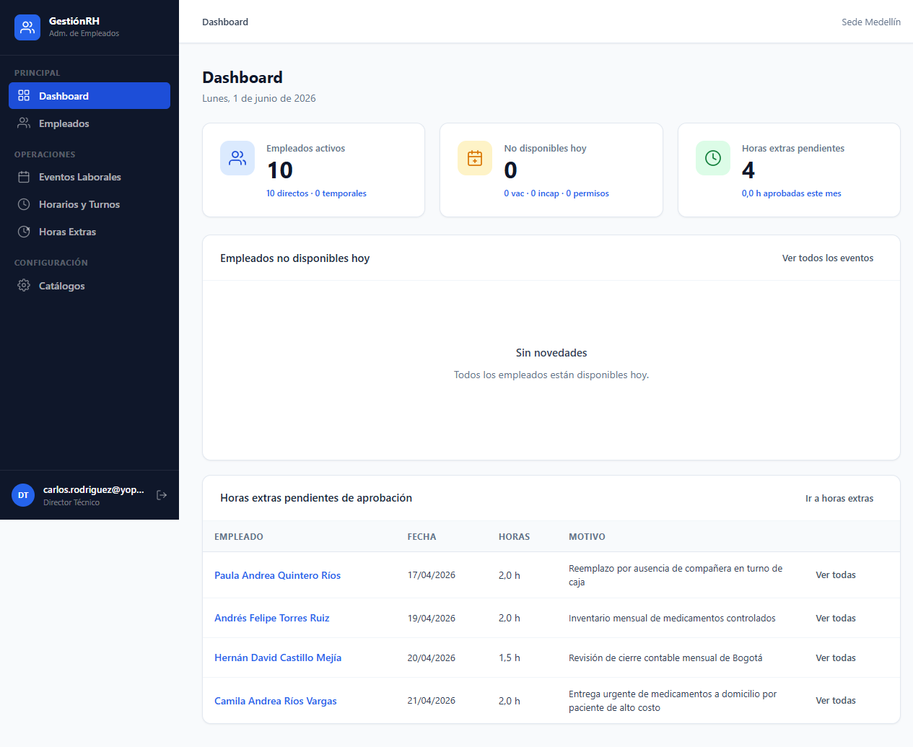
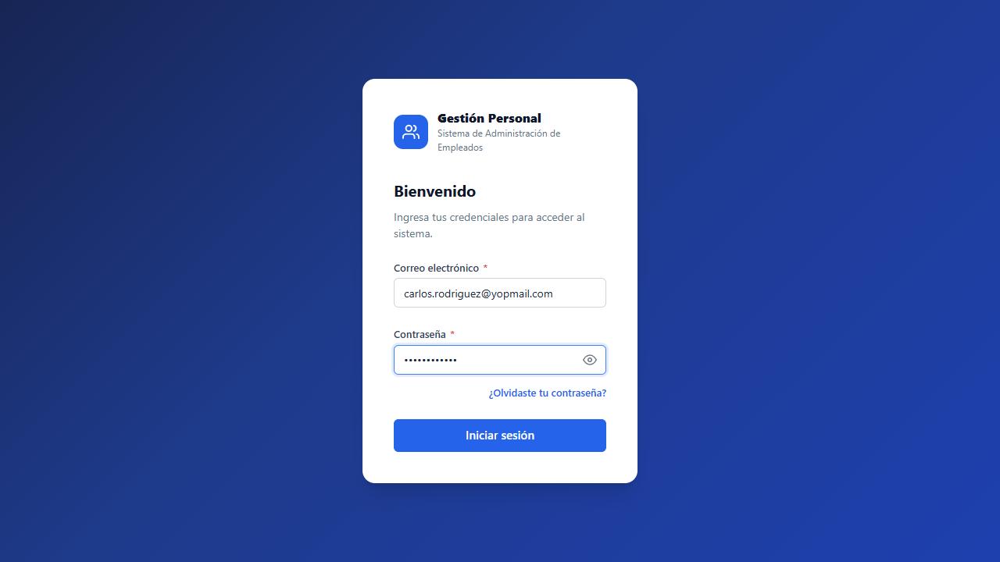
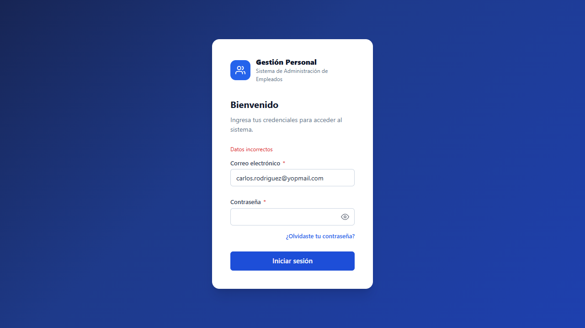

# Informe de prueba de humo — Inicio de sesión

| Campo | Valor |
|-------|--------|
| **Fecha de ejecución** | 2026-06-01 15:53:09 |
| **Entorno** | `http://localhost:5002` — GestionPersonal (GestiónRH) |
| **Navegador** | Google Chrome (headed, `slowMo` 400 ms) |
| **Herramienta** | Playwright + TypeScript |
| **Resultado global** | **PASS** |

---

## Resumen ejecutivo

Se ejecutó una prueba de **humo** acotada al camino crítico de autenticación: cargar la pantalla de login, iniciar sesión con el usuario Jefe del seeding y validar el rechazo ante contraseña incorrecta. Ambos escenarios cumplieron las expectativas; las capturas adjuntas documentan cada paso en Chrome visible.

Alcance definido según [Shape Up](https://basecamp.com/shapeup): *small batch*, tiempo fijo y alcance variable. Detalle del pitch en `Requisitos/Pitch-Humo-InicioSesion-ShapeUp.md`.

---

## Usuarios utilizados

| Escenario | Rol | Correo | Contraseña | Propósito |
|-----------|-----|--------|------------|-----------|
| Éxito | Jefe (Carlos Rodríguez) | `carlos.rodriguez@yopmail.com` | `Usuario1` | Verificar acceso tras credenciales válidas del seeding |
| Fallo | Misma cuenta | `carlos.rodriguez@yopmail.com` | `WrongPass123` | Verificar permanencia en login y mensaje de error |

> Fuente de datos: `Documentos/BD/Seeding_Completo.sql`.

---

## Alcance Shape Up (must-haves)

- [x] Chrome en modo visible (headed)
- [x] Login exitoso con usuario Jefe
- [x] Login fallido con mensaje en formulario
- [x] Informe con imágenes por paso
- [ ] ~ Casos TC-03 / TC-04 (fuera de appetite — *no-gos*)

---

## Pasos ejecutados

### Paso 1 — Abrir pantalla de login

Se navegó a `/Cuenta/Login` y se esperó carga de red.


---

### Paso 2 — Formulario con credenciales válidas (antes de enviar)

Correo: `carlos.rodriguez@yopmail.com` · Contraseña: `Usuario1`


---

### Paso 3 — Resultado tras login exitoso

**URL observada:** `http://localhost:5002/Dashboard/Index`

**Criterio:** redirección a `/Dashboard` o `/Cuenta/CambiarPassword`.



---

### Paso 4 — Formulario con contraseña incorrecta

Correo: `carlos.rodriguez@yopmail.com` · Contraseña: `WrongPass123`



---

### Paso 5 — Mensaje de error en inicio de sesión fallido

**URL observada:** `http://localhost:5002/` (debe permanecer en Login)

**Mensaje(s) en pantalla (selector `.form-error`):**

> **Datos incorrectos**



---

## Mensajes ante fallo de inicio de sesión

| Situación | Comportamiento esperado | Observado |
|-----------|-------------------------|-----------|
| Contraseña incorrecta | Permanece en `/Cuenta/Login`; error en `.form-error` (ej. *Datos incorrectos*) | `Datos incorrectos` |
| App no disponible | `ERR_CONNECTION_REFUSED` | No aplica en esta ejecución |
| Credenciales válidas pero sin redirección | Fallo de assertion Playwright | No ocurrió |

---

## Comandos para reproducir

```powershell
cd "c:\Users\alejandro.ortiz\Documents\helpharma\Desarrollos\lissy\IA\LissyIAHelpharma\empleados v2\Documentos\Pruebas\Playwright\PruebasImagenes"
npm install
npx playwright install chrome
npx playwright test tests/smoke-inicio-sesion.spec.ts --headed --project=chrome
node scripts/generar-informe-inicio-sesion.mjs
```

---

## Referencias

- `Requisitos/Especificacion-Sistema-Prueba-Humo-InicioSesion.md`
- `Requisitos/Pitch-Humo-InicioSesion-ShapeUp.md`
- `../../Plan-Ejecucion-Playwright-Login.md`
